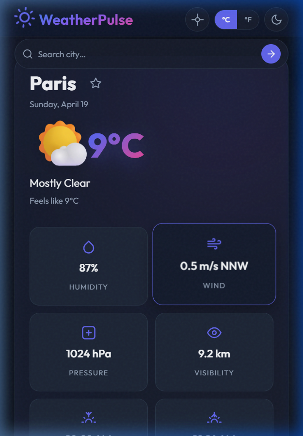
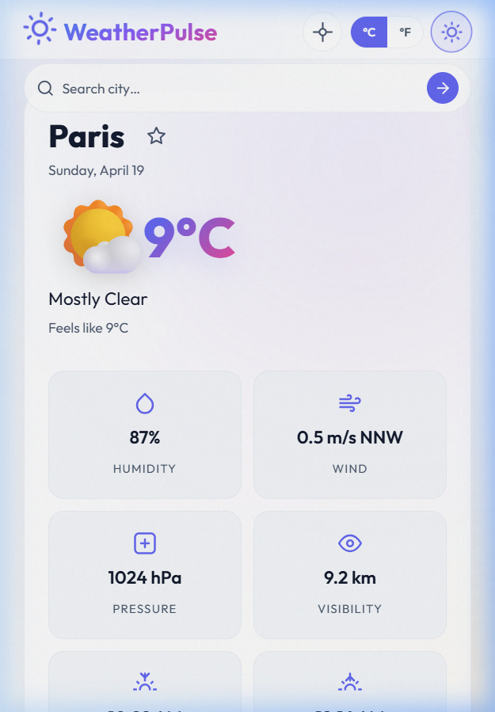
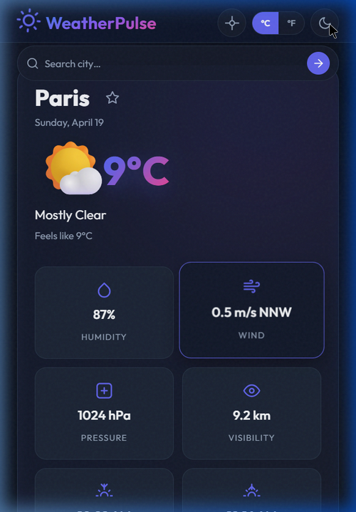
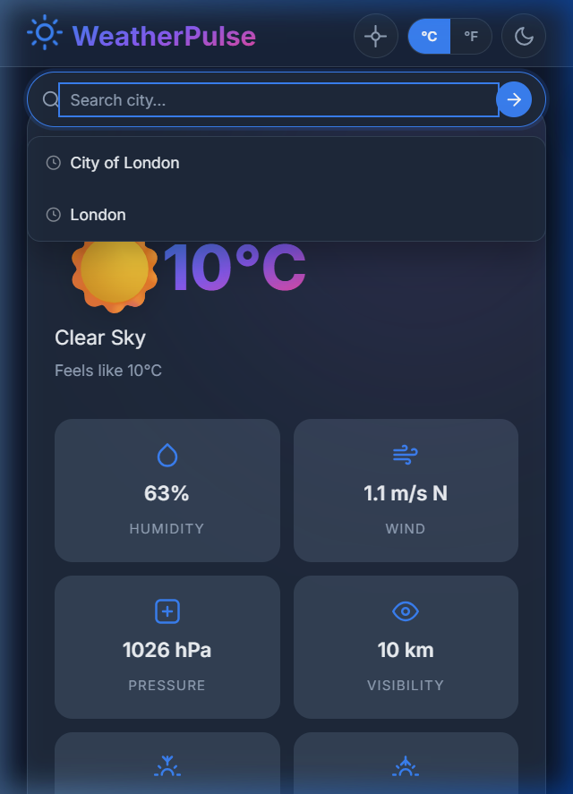
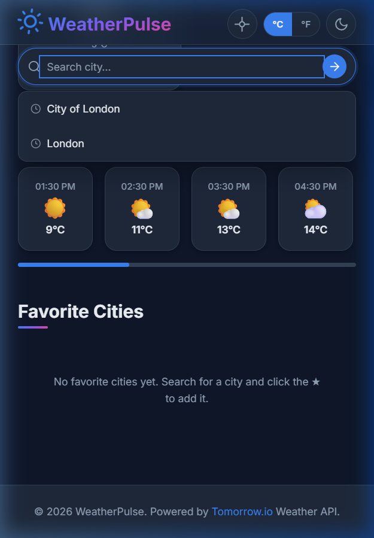

# ☁️ WeatherPulse — Weather Dashboard Application

> A modern, responsive weather dashboard that fetches real-time data from the **Tomorrow.io** Weather API. Built with vanilla JavaScript using async/await, ES modules, and Local Storage persistence.



---

## 📋 Table of Contents

- [Project Overview](#-project-overview)
- [Features](#-features)
- [Tech Stack](#-tech-stack)
- [Project Structure](#-project-structure)
- [Setup Instructions](#-setup-instructions)
- [API Integration](#-api-integration)
- [Async JavaScript Usage](#-async-javascript-usage)
- [Data Handling](#-data-handling)
- [Local Storage Implementation](#-local-storage-implementation)
- [Code Architecture](#-code-architecture)
- [Screenshots](#-screenshots)
- [Testing Evidence](#-testing-evidence)
- [Deployment](#-deployment)

---

## 🎯 Project Overview

**WeatherPulse** is a fully-featured weather dashboard application built as a Week 6 project focusing on **Advanced JavaScript & APIs**. The app demonstrates mastery of:

- **Asynchronous JavaScript** — Promises, async/await, parallel fetching with `Promise.all`
- **REST API Integration** — Tomorrow.io realtime weather, hourly forecast, and daily forecast endpoints
- **JSON Data Handling** — Parsing, transformation, and rendering of complex API responses
- **Local Storage** — Persistent user preferences, favorites, search history, and response caching
- **JavaScript Modules** — Clean ES module architecture with separation of concerns
- **Error Handling** — Comprehensive try/catch, timeout with AbortController, graceful fallbacks

### Goals & Objectives

| Goal | Implementation |
|------|---------------|
| Fetch live weather data | `async/await` with Tomorrow.io API (free key) |
| Display current conditions | Temperature, humidity, wind, pressure, visibility, sunrise/sunset |
| Show 5-day forecast | Daily high/low temperatures from `/forecast?timesteps=1d` |
| Hourly forecast | Scrollable hourly cards from `/forecast?timesteps=1h` |
| City search with debounce | Input debouncing (350ms) prevents excessive API calls |
| Geolocation support | Browser Geolocation API for automatic location detection |
| User preferences | Theme, units, default city persisted in Local Storage |
| Favorite cities | Add/remove favorites with live mini-weather cards |
| Premium Design | Mesh gradients, 3D perspective tilt, and aurora branding |
| Atmospheric Theme | Background colors dynamically adjust to match weather conditions |
| Loading states | Skeleton shimmer animations during data fetches |
| Error handling | Toast notifications, timeout handling, graceful fallbacks |

---

## ✨ Features

### Core Features
- 🌡️ **Current Weather** — Real-time temperature, feels like, description, and weather emoji
- 📅 **5-Day Forecast** — Daily high/low temperatures with weather conditions
- ⏰ **Hourly Forecast** — 12-hour scrollable timeline with temperature trends
- 🔍 **City Search** — Search with debounced input and recent search suggestions
- 📍 **Geolocation** — One-click location detection via browser API
- ⭐ **Favorite Cities** — Save up to 12 favorites with live weather previews

### User Experience
- 🌓 **Dark / Light Theme** — Toggle with persistent preference
- 🌡️ **Unit Toggle** — Switch between Celsius (°C) and Fahrenheit (°F)
- 💀 **Skeleton Loading** — Shimmer placeholders while data loads
- 🔔 **Toast Notifications** — Success and error messages with auto-dismiss
- 📱 **Fully Responsive** — Mobile-first design, works on all screen sizes
- ♿ **Accessible** — ARIA labels, keyboard navigation, reduced-motion support

### Stunning Design Effects
- ✨ **Atmospheric Engine** — Background mesh gradients dynamically shift color to match the city's weather (Clear, Cloudy, Rainy, Snowy).
- 🧊 **3D Perspective Tilt** — The current weather card Physically reacts to mouse movements with a cinematic 3D tilt.
- 🔦 **Glass Shine Reflection** — Dynamic radial reflections follow the cursor across glass surfaces for ultra-realistic depth.
- 🌈 **Aurora Branding** — The 'WeatherPulse' logo features a living, breathing animated gradient.
- 🫧 **Ambient Particles** — Subtle floating particles add life and motion to the background layer.
- 🎞️ **Scroll Reveal** — Sections glide into view using `IntersectionObserver` for high-fidelity storytelling.

### Technical Features
- ⚡ **Response Caching** — 10-minute TTL cache reduces redundant API calls
- ⏱️ **Request Timeout** — 10-second timeout with AbortController
- 🧩 **ES Modules** — Clean module architecture (`app.js`, `api.js`, `storage.js`)
- 🎨 **Modern Design System** — Outfit typography, glassmorphism, and custom CSS variables

---

## 🛠️ Tech Stack

| Technology | Purpose |
|-----------|---------|
| **HTML5** | Semantic structure with ARIA attributes |
| **CSS3** | Custom properties, Grid, Flexbox, animations, glassmorphism |
| **Vanilla JavaScript (ES2022+)** | Modules, async/await, Fetch API, AbortController |
| **Tomorrow.io API** | Realtime weather, hourly forecast, daily forecast |
| **Local Storage API** | Preferences, favorites, history, caching |
| **Geolocation API** | Browser-based location detection |
| **Google Fonts** | Inter + JetBrains Mono typography |

---

## 📁 Project Structure

```
Week-6/
├── index.html              # Main HTML entry point
├── css/
│   └── styles.css          # Complete CSS design system
├── js/
│   ├── app.js              # Main application controller (UI + events)
│   ├── api.js              # Tomorrow.io API integration layer
│   └── storage.js          # Local Storage abstraction layer
├── screenshots/            # Visual documentation
│   ├── dashboard-light.png
│   ├── dashboard-dark.png
│   ├── mobile-view.png
│   ├── search-feature.png
│   └── favorites-panel.png
└── README.md               # Project documentation (this file)
```

### File Responsibilities

| File | Responsibility |
|------|---------------|
| `index.html` | Semantic HTML structure, SVG icons, layout sections |
| `css/styles.css` | Design tokens, component styles, responsive breakpoints, dark theme |
| `js/app.js` | DOM binding, event handlers, rendering, state management |
| `js/api.js` | API calls, weather code mapping, caching integration, formatters |
| `js/storage.js` | localStorage CRUD, preferences, favorites, history, cache |

---

## 🚀 Setup Instructions

### Prerequisites
- A modern web browser (Chrome 90+, Firefox 88+, Edge 90+, Safari 14+)
- A local development server (for ES module support)

### Step-by-Step Installation

1. **Clone the repository**
   ```bash
   git clone https://github.com/Vinsai2003/Weatherpulse.git
   cd Weatherpulse
   ```

2. **Open with a local server**
   ```bash
   # Using Python
   python -m http.server 8080

   # Using Node.js
   npx serve .

   # Using VS Code
   # Install "Live Server" extension → right-click index.html → "Open with Live Server"
   ```

3. **Explore the dashboard!**
   - The app loads London weather by default
   - Search for any city worldwide
   - Toggle between °C and °F
   - Switch dark/light theme
   - Add cities to favorites
   - Use geolocation for your current location

> **Note:** A Tomorrow.io API key is already embedded in the application. The free tier allows 25 requests/hour and 500 requests/day. If you see errors, wait a few minutes for the rate limit to reset.

---

## 🌐 API Integration

### Tomorrow.io API Endpoints Used

| Endpoint | Method | Purpose |
|----------|--------|---------|
| `/v4/weather/realtime` | GET | Current weather conditions |
| `/v4/weather/forecast?timesteps=1h` | GET | Hourly forecast (120 hours) |
| `/v4/weather/forecast?timesteps=1d` | GET | Daily forecast (5 days) |

### Request Example

```javascript
// api.js — fetchRealtimeWeather()
const url = `https://api.tomorrow.io/v4/weather/realtime`
  + `?location=${encodeURIComponent(city)}`
  + `&apikey=${API_KEY}`
  + `&units=${units}`;

const response = await fetch(url, { signal: controller.signal });
```

### Weather Code Mapping

Tomorrow.io uses numeric weather codes. We map them to descriptions and emoji:

```javascript
const WEATHER_CODES = {
  1000: { description: 'Clear Sky',       emoji: '☀️'  },
  1001: { description: 'Cloudy',           emoji: '☁️'  },
  1100: { description: 'Mostly Clear',     emoji: '🌤️' },
  1101: { description: 'Partly Cloudy',    emoji: '⛅'  },
  4001: { description: 'Rain',             emoji: '🌧️' },
  5000: { description: 'Snow',             emoji: '❄️'  },
  8000: { description: 'Thunderstorm',     emoji: '⛈️'  },
  // ... 20+ weather codes mapped
};
```

### Response Structure

```json
{
  "data": {
    "time": "2026-04-19T07:10:00Z",
    "values": {
      "temperature": 7.8,
      "temperatureApparent": 7.8,
      "humidity": 69,
      "windSpeed": 0.9,
      "windDirection": 343,
      "pressureSeaLevel": 1025.82,
      "visibility": 10,
      "weatherCode": 1000
    }
  },
  "location": {
    "lat": 51.51,
    "lon": -0.09,
    "name": "City of London, Greater London, England, United Kingdom"
  }
}
```

---

## ⚡ Async JavaScript Usage

### Patterns Demonstrated

#### 1. Async/Await with Error Handling (try/catch/finally)

```javascript
async function loadCity(city) {
  try {
    showLoadingState();
    const [realtime, hourly, daily] = await Promise.all([
      fetchRealtimeWeather(city, state.units),
      fetchHourlyForecast(city, state.units),
      fetchDailyForecast(city, state.units),
    ]);
    renderCurrentWeather(realtime, daily);
    renderForecast(daily);
    renderHourly(hourly);
  } catch (err) {
    showError(err.message || 'Failed to fetch weather data.');
  } finally {
    state.isLoading = false;
  }
}
```

#### 2. Parallel Fetching with Promise.all

```javascript
// All 3 API calls execute simultaneously, not sequentially
const [realtime, hourly, daily] = await Promise.all([
  fetchRealtimeWeather(city, units),    // realtime endpoint
  fetchHourlyForecast(city, units),     // hourly forecast
  fetchDailyForecast(city, units),      // daily forecast
]);
```

#### 3. Promise.allSettled for Graceful Partial Failures

```javascript
// Fetch weather for all favorite cities — don't fail if one city errors
const results = await Promise.allSettled(
  favs.map((city) => fetchRealtimeWeather(city, state.units))
);
results.forEach((r, i) => {
  if (r.status === 'fulfilled') renderFavCard(r.value);
  // rejected promises are silently skipped
});
```

#### 4. AbortController for Request Timeout

```javascript
async function fetchJSON(url) {
  const controller = new AbortController();
  const timer = setTimeout(() => controller.abort(), 10000);
  try {
    const response = await fetch(url, { signal: controller.signal });
    return await response.json();
  } catch (err) {
    if (err.name === 'AbortError') throw new Error('Request timed out.');
    throw err;
  } finally {
    clearTimeout(timer);
  }
}
```

#### 5. Debouncing for Search Input

```javascript
function debounce(fn, wait) {
  let timer;
  return function (...args) {
    clearTimeout(timer);
    timer = setTimeout(() => fn.apply(this, args), wait);
  };
}
// Only fires 350ms after user stops typing
dom.cityInput.addEventListener('input', debounce(handleSearchInput, 350));
```

---

## 📊 Data Handling

### JSON Transformation Pipeline

```
Tomorrow.io API Response (raw JSON)
    ↓
fetchJSON() — validates HTTP status, parses JSON
    ↓
setCachedData() — stores in localStorage with timestamp
    ↓
getWeatherInfo() — maps weatherCode to emoji + description
    ↓
render*() — maps data to HTML via template literals
```

### Weather Code Mapping System

Tomorrow.io returns numeric weather codes (e.g., `1000`, `1101`). The `getWeatherInfo()` function maps each code to a human-readable description and an emoji icon:

```javascript
export function getWeatherInfo(code) {
  return WEATHER_CODES[code] || {
    description: 'Unknown',
    emoji: '❓',
    bg: 'clear'
  };
}
```

### Data Extraction Pattern

```javascript
// Realtime response → current weather UI
const v = realtime.data.values;
dom.currentTemp.textContent = `${Math.round(v.temperature)}°C`;
dom.humidityVal.textContent = `${v.humidity}%`;
dom.windVal.textContent     = `${v.windSpeed} m/s ${windDirection(v.windDirection)}`;
```

---

## 💾 Local Storage Implementation

### Storage Architecture

| Key | Type | Purpose |
|-----|------|---------|
| `weatherpulse_preferences` | Object | `{ defaultCity, units, theme }` |
| `weatherpulse_favorites` | Array | List of favorite city names (max 12) |
| `weatherpulse_search_history` | Array | Recent searches (max 8, LIFO) |
| `weatherpulse_cache` | Object | Response cache with TTL timestamps |

### Safe Read/Write Pattern

```javascript
function readJSON(key, fallback = null) {
  try {
    const raw = localStorage.getItem(key);
    return raw !== null ? JSON.parse(raw) : fallback;
  } catch (err) {
    console.warn(`[Storage] Failed to read "${key}":`, err);
    return fallback;
  }
}
```

### Preference Merging

Preferences are merged with defaults so newly added settings don't break existing users:

```javascript
export function loadPreferences() {
  const stored = readJSON(KEYS.PREFERENCES, {});
  return { ...DEFAULT_PREFERENCES, ...stored };
}
```

### Cache with TTL (Time-To-Live)

API responses are cached for 10 minutes to avoid redundant calls and respect API rate limits:

```javascript
const CACHE_TTL = 10 * 60 * 1000; // 10 minutes

export function getCachedData(endpoint, query, units) {
  const cache = readJSON(KEYS.CACHE, {});
  const entry = cache[cacheKey(endpoint, query, units)];
  if (!entry || Date.now() - entry.timestamp > CACHE_TTL) return null;
  return entry.data;
}
```

---

## 🏗️ Code Architecture

### Module Dependency Graph

```
index.html
  └── js/app.js (main controller)
        ├── js/api.js (API layer)
        │     └── js/storage.js (cache read/write)
        └── js/storage.js (preferences, favorites, history)
```

### Design Principles

1. **Separation of Concerns** — Each module has a single responsibility
2. **Pure Functions** — Storage and API helpers are stateless and testable
3. **Defensive Coding** — Every API call wrapped in try/catch with fallbacks
4. **DRY** — Shared utilities (debounce, formatters) reused across modules
5. **Progressive Enhancement** — Graceful handling of API failures and rate limits

### State Management

A simple state object in `app.js` tracks the current application state:

```javascript
let state = {
  city: '',         // Currently displayed city
  units: 'metric',  // Temperature unit
  theme: 'light',   // UI theme
  isLoading: false,  // Prevents duplicate requests
};
```

---

## 📸 Screenshots

### Light Theme Dashboard


### Dark Theme Dashboard


### Mobile Responsive View


### City Search with Suggestions


### Favorite Cities Panel


---

## 🧪 Testing Evidence

### Functional Tests

| Test Case | Status | Description |
|-----------|--------|-------------|
| City search | ✅ Pass | Searching "London" returns correct weather data |
| 5-day forecast | ✅ Pass | Forecast shows next 5 days with daily high/low temps |
| Hourly forecast | ✅ Pass | 12 hourly cards render with correct time and temp |
| Unit toggle (°C ↔ °F) | ✅ Pass | All temperatures update, preference persists |
| Theme toggle | ✅ Pass | Dark/light mode toggles, persists across refresh |
| Add to favorites | ✅ Pass | Star activates, city appears in favorites grid |
| Remove from favorites | ✅ Pass | City removed from grid and localStorage |
| Geolocation | ✅ Pass | Detects location and loads local weather |
| API error handling | ✅ Pass | Rate-limit errors show toast, app stays usable |
| Network timeout | ✅ Pass | AbortController triggers after 10s |
| Search debounce | ✅ Pass | Input waits 350ms before processing |
| Local Storage persistence | ✅ Pass | All preferences survive page refresh |
| Responsive layout | ✅ Pass | Adapts to 320px–1440px+ viewports |
| Keyboard navigation | ✅ Pass | All controls accessible via Tab/Enter/Escape |
| Cache system | ✅ Pass | Repeated requests served from cache within TTL |

### Browser Compatibility

| Browser | Version | Status |
|---------|---------|--------|
| Chrome | 120+ | ✅ Full Support |
| Firefox | 118+ | ✅ Full Support |
| Edge | 120+ | ✅ Full Support |
| Safari | 17+ | ✅ Full Support |

---

## 🚢 Deployment

The app is a static site and can be deployed to any hosting platform:

- **GitHub Pages** — Push to `main`, enable Pages in repository settings
- **Netlify** — Drag-and-drop the project folder
- **Vercel** — Import the GitHub repository

---

## 📄 License

This project is built for educational purposes as part of a web development course ( Advanced JavaScript & APIs).

---

<p align="center">
  Built with  vanilla JavaScript, async/await, and the Tomorrow.io Weather API.
</p>
